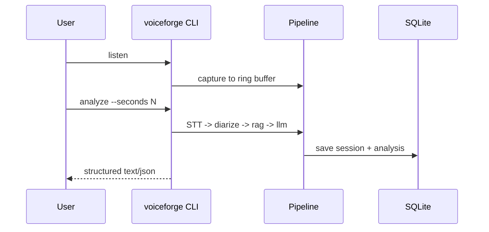

# Architecture Overview (alpha0.1)

VoiceForge pipeline:
1. Capture audio via PipeWire into ring buffer.
2. Transcribe with faster-whisper.
3. Run diarization with pyannote.
4. Build optional RAG context from local KB.
5. Run LLM analysis on transcript/context.
6. Save transcript and analysis into SQLite.

Core runtime modules:
- `src/voiceforge/audio/`
- `src/voiceforge/stt/`
- `src/voiceforge/rag/`
- `src/voiceforge/llm/`
- `src/voiceforge/core/`
- `src/voiceforge/main.py`

## Runtime flow

