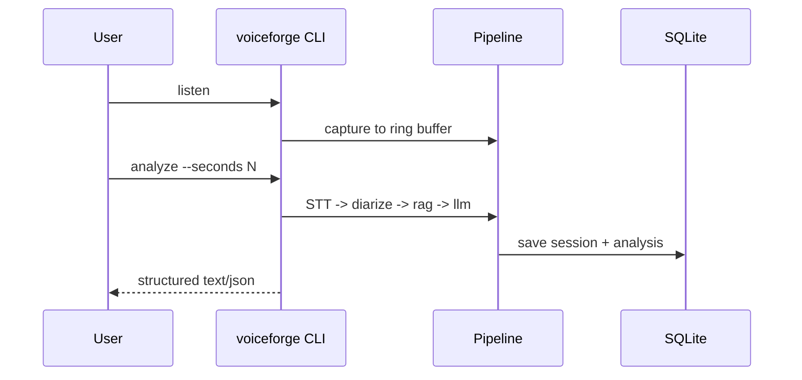

# Runtime Flow (alpha0.1)

```mermaid
sequenceDiagram
  participant U as User
  participant CLI as voiceforge CLI
  participant P as Pipeline
  participant DB as SQLite

  U->>CLI: listen
  CLI->>P: capture to ring buffer

  U->>CLI: analyze --seconds N
  CLI->>P: STT -> diarize -> rag -> llm
  P->>DB: save session + analysis
  CLI-->>U: structured text/json
```
