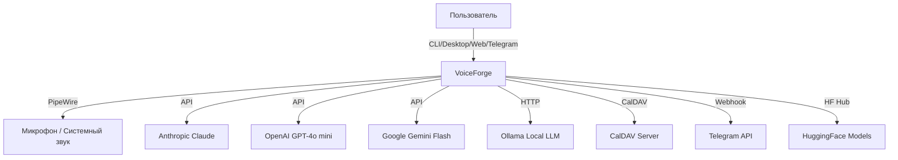
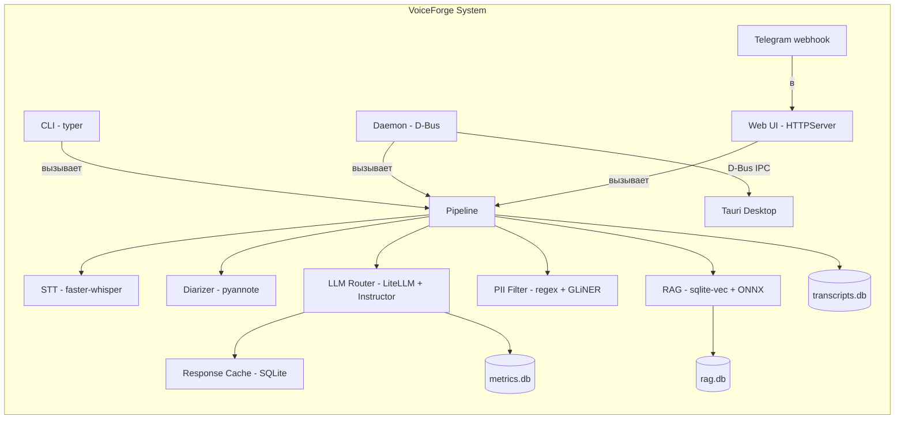

# PROJECT_AUDIT_AND_ROADMAP — VoiceForge

Дата: 2026-02-26 | Branch: `main` | Commit: `6a49402`

---

## 0) Executive summary (10 bullets)

1. **VoiceForge** — local-first AI-ассистент для аудиовстреч на Linux: запись (PipeWire) → транскрипция (faster-whisper) → диаризация (pyannote) → RAG-контекст (sqlite-vec + ONNX) → LLM-анализ (LiteLLM + Instructor) → структурированный вывод (SQLite).
2. **Версия:** 0.2.0-alpha.1. ~7 500 строк Python в 49 модулях, 8 подсистем. Десктоп (Tauri 2 + D-Bus), CLI (9 замороженных команд, ADR-0001), Web UI (stdlib HTTPServer), Telegram-бот.
3. **Зрелость:** ранняя альфа. Ядро полностью функционально, roadmap 1–13 из 20 выполнен. Документация — исключительная (62 markdown-файла, билингвальная, agent-aware).
4. **Главные риски:** pyannote OOM (≤8 ГБ RAM, нет systemd-лимитов); качество LLM-вывода не измеряется в CI (eval harness не интегрирован); coverage-отчёт исключает 5 критичных модулей.
5. **Безопасность:** keyring для секретов, 5 инструментов сканирования (gitleaks, bandit, pip-audit, semgrep, CodeQL). CVE-2025-69872 (diskcache) отслеживается. SQL-инъекции невозможны (параметризованные запросы).
6. **CI/CD:** 8 GitHub Actions workflows, матричное тестирование (Python 3.12/3.13), SBOM (CycloneDX), Flatpak, release-drafter. Sonar и CodeQL — non-blocking (continue-on-error: true).
7. **Стек:** Python 3.12+ / uv, Rust (Tauri 2), TS (Vite), SQLite, D-Bus, PipeWire. Нативная Linux-установка, без Docker/k8s.
8. **Главные возможности роста:** eval harness в CI → измерение качества; circuit breaker → надёжность LLM; observability (трейсинг, алерты, дашборды) → production readiness.
9. **Сильные стороны:** документация (5/5), CI/CD (4/5), безопасность (4/5), качество кода (4/5), graceful degradation на каждом шаге пайплайна.
10. **Итог аудита:** проект на уверенном альфа-уровне с сильным фундаментом. Критические зоны для hardening: AI quality (eval), observability (трейсинг + алерты), reliability (circuit breaker), testing (покрытие исключённых модулей).

---

## 1) Assumptions & Unknowns

### Допущения
- Solo-dev pattern (один основной разработчик, судя по коммитам и отсутствию CODEOWNERS).
- Целевая платформа: Fedora Atomic / toolbox. Другие Linux-дистрибутивы — secondary.
- Нет внешних пользователей (alpha), SLO/SLA не определены.
- Бюджет LLM: $75/мес (`budget_limit_usd` в `core/config.py`), ежедневный лимит: auto ($75/30 = $2.5).
- GPU не обязателен: CPU-only path (faster-whisper INT8 + ONNX embedder).
- Web UI привязан к `127.0.0.1` — не предназначен для внешнего доступа.

### Что не удалось подтвердить
- Реальное покрытие тестами: CI использует `--cov-fail-under=80` для основного кода, но 5 модулей исключены из `omit` (`pyproject.toml` L111-118). Фактическое покрытие критичного кода неизвестно.
- Состояние SonarCloud quality gate (скрипт `sonar_fetch_issues.py` не запускался в рамках аудита).
- Работоспособность Flatpak-сборки на целевом железе.
- Реальное потребление RAM pyannote 4.0.4 на ≤8 ГБ.
- Наличие `voiceforge.yaml` у пользователей (всё работает на defaults без него).
- Актуальность CVE-2025-69872: есть ли upstream-фикс для diskcache.

---

## 2) Current state ("Where we are now")

### 2.1 Product snapshot

**Пользователи:** разработчики/менеджеры, проводящие аудиовстречи на Linux.

**Use-cases:**
- Запись встречи (PipeWire) → транскрипция → анализ (вопросы, ответы, рекомендации, action items)
- 5 шаблонов: standup, sprint_review, one_on_one, brainstorm, interview
- Поиск по истории встреч (FTS5)
- RAG: контекст из документов (PDF, DOCX, MD, HTML, ODT, RTF)
- PII-фильтрация (regex + GLiNER): email, телефоны, ИНН, СНИЛС, карты
- Live summary во время записи
- Streaming STT в CLI
- Action items: трекинг между сессиями
- CalDAV-интеграция: инъекция контекста из календаря
- Telegram-бот: push-нотификации, команды через webhook
- Контроль расходов: бюджет, дневные лимиты, кеширование ответов

**Non-goals (текущие):**
- macOS / Windows (roadmap #20)
- Облачный деплой / multi-tenant
- Real-time collaboration

### 2.2 Architecture map (C4)

#### Context diagram



#### Container diagram



#### Component diagram (ключевые модули)

| Подсистема | Модули | Ответственность |
|---|---|---|
| `audio/` | `capture.py`, `buffer.py`, `smart_trigger.py` | PipeWire-захват, кольцевой буфер, VAD-триггер |
| `stt/` | `transcriber.py`, `diarizer.py`, `streaming.py` | faster-whisper, pyannote, streaming STT |
| `rag/` | `embedder.py`, `indexer.py`, `searcher.py`, `parsers.py`, `query_keywords.py`, `watcher.py` | ONNX-эмбеддинг, FTS5 + vector search, multi-format парсинг |
| `llm/` | `router.py`, `schemas.py`, `pii_filter.py`, `prompt_loader.py`, `cache.py`, `local_llm.py` | LiteLLM routing, Instructor schemas, PII, кеш |
| `core/` | `config.py`, `pipeline.py`, `daemon.py`, `metrics.py`, `transcript_log.py`, `observability.py`, `secrets.py`, `contracts.py` | Конфигурация, пайплайн, D-Bus daemon, метрики, SQLite |
| `web/` | `server.py` | HTTP API, Telegram webhook, Prometheus /metrics |
| `calendar/` | `caldav_poll.py` | CalDAV polling |
| `cli/` | `status_helpers.py`, `history_helpers.py` | CLI-хелперы |
| `i18n/` | `__init__.py` | Интернационализация (RU/EN) |

#### Data flow

```
Микрофон → PipeWire (pw-record) → AudioCapture → RingBuffer (int16, 16kHz)
    ↓
Step 1 (serial): Resample → faster-whisper → Segments + Transcript
    ↓
Step 2 (parallel, ThreadPoolExecutor, timeout 25s):
    ├─ Diarizer (pyannote, 2GB RAM guard) → DiarSegments
    ├─ RAG (keyword extraction → multi-query → HybridSearcher) → Context
    └─ PII Filter (regex + GLiNER) → RedactedTranscript
    ↓
Step 3 (serial): LLM Router (budget check → cache → Instructor → fallbacks)
    ↓
SQLite: sessions + segments + analysis + action_items + metrics
```

### 2.3 Repo map

```
voiceforge/
├── src/voiceforge/          # ~7500 строк Python, 49 модулей
│   ├── audio/               # Захват PipeWire, кольцевой буфер, VAD
│   ├── stt/                 # STT, диаризация, streaming
│   ├── rag/                 # Индексация, поиск, парсеры, embedder
│   ├── llm/                 # LLM routing, schemas, PII, prompts, cache
│   ├── core/                # Config, pipeline, daemon, metrics, DB
│   ├── web/                 # HTTP server + Telegram
│   ├── calendar/            # CalDAV
│   ├── cli/                 # CLI helpers
│   ├── i18n/                # RU/EN
│   └── main.py              # CLI entrypoint (typer)
├── desktop/                 # Tauri 2 (Rust + Vite)
│   ├── src/                 # JS + CSS frontend
│   ├── src-tauri/           # Rust backend (D-Bus client)
│   └── flatpak/             # Flatpak manifest
├── tests/                   # 19 test-модулей + eval/
│   ├── eval/                # LLM eval harness + golden samples
│   └── fixtures/            # WAV-файлы для тестов
├── docs/                    # 62 markdown-файла
│   ├── architecture/        # Архитектура + overview
│   ├── adr/                 # ADR-0001..0006
│   ├── runbooks/            # 20+ runbooks
│   ├── en/                  # English translations
│   └── history/             # Закрытые планы
├── scripts/                 # 25 скриптов (CI, build, governance)
├── .github/workflows/       # 8 CI/CD workflows
├── pyproject.toml           # Python config (uv, ruff, pytest, coverage)
├── Makefile                 # 15 build targets
└── sonar-project.properties # SonarCloud
```

**Точки входа:**
- CLI: `voiceforge` → `src/voiceforge/main.py` (typer)
- Daemon: `voiceforge daemon` → `core/daemon.py` (D-Bus, systemd)
- Web: `voiceforge web` → `web/server.py` (HTTPServer :8765)
- Desktop: Tauri → `desktop/src-tauri/` (D-Bus client)
- Module: `python -m voiceforge` → `__main__.py`

### 2.4 AI subsystem

**Тип:** LLM app + RAG + speech processing (STT + diarization).

**Данные:**
- Источники: аудиовход (PipeWire), документы (PDF/DOCX/MD/HTML/ODT/RTF), CalDAV
- Хранение: SQLite (transcripts.db, metrics.db, rag.db)
- Пайплайн: capture → STT → parallel (diar + RAG + PII) → LLM → save

**Модели / провайдеры:**
| Модель | Назначение | Файл |
|---|---|---|
| faster-whisper (small, INT8) | STT | `stt/transcriber.py` |
| pyannote.audio 4.0.4 | Диаризация | `stt/diarizer.py` |
| all-MiniLM-L6-v2 (ONNX) | RAG embeddings | `rag/embedder.py` |
| GLiNER (опционально) | PII NER | `llm/gliner_ner.py` |
| Claude Haiku 4.5 (default) | LLM-анализ | `llm/router.py` |
| GPT-4o mini, Gemini Flash, Claude Sonnet | Fallback LLM | `llm/router.py` |
| Ollama (phi3:mini) | FAQ/classify (локально) | `llm/local_llm.py` |

**Промпты / шаблоны:**
- Файлы: `src/voiceforge/llm/prompts/` (analysis.txt, template_*.txt, version=1)
- Fallback: hardcoded в `router.py` L29-76
- 5 шаблонов: standup, sprint_review, one_on_one, brainstorm, interview (`llm/schemas.py`)

**Eval / метрики / guardrails:**
- `tests/eval/test_llm_eval.py` + 21 golden sample в `tests/eval/golden_samples/`
- ROUGE-L scoring, LLM-judge test
- НЕ интегрировано в CI (см. W1)
- Guardrails: PII-фильтр (3 режима: OFF/EMAIL_ONLY/ON), budget enforcement, response caching

### 2.5 Engineering maturity snapshot

| Категория | Оценка | Комментарий | Доказательства |
|---|:---:|---|---|
| **Code Quality** | 4/5 | Ruff (8 категорий правил), mypy (4 пакета), Sonar, чистая структура | `pyproject.toml` L79-98; `.pre-commit-config.yaml`; `sonar-project.properties` |
| **Tests** | 3/5 | 19 test-файлов, target 80%, но 5 модулей исключены из coverage | `pyproject.toml` L111-118; `tests/` (19 файлов) |
| **CI/CD** | 4/5 | 8 workflows, SBOM, Flatpak, matrix, release-drafter | `.github/workflows/` (8 файлов); `release.yml` |
| **Security** | 4/5 | 5 инструментов, keyring, param SQL; CVE tracked | `gitleaks.yml`, `semgrep.yml`, `codeql.yml`, `test.yml` L117-118 |
| **Observability** | 2/5 | structlog + 6 Prometheus metrics + /metrics; нет дашбордов, алертов, трейсинга | `core/observability.py`; `web/server.py` L525+; `docs/grafana-voiceforge-dashboard.json` (не задеплоен) |
| **Reliability** | 3/5 | Timeouts, fallbacks, graceful degradation; нет circuit breaker | `core/pipeline.py` L19-20; `llm/router.py` L27 |
| **Performance/Cost** | 3/5 | Budget enforcement, response cache, lazy loading; нет бенчмарков | `llm/router.py`; `llm/cache.py`; `core/config.py` |
| **Docs/Onboarding** | 5/5 | 62 файла, билингвально, ADR, runbooks, agent-aware handoff | `docs/` (62 файла); `DOCS-INDEX.md` |
| **AI Quality** | 2/5 | Eval harness есть, но не в CI; нет regression suite | `tests/eval/`; `.github/workflows/test.yml` (нет eval job) |
| **Data Governance** | 2/5 | PII-фильтр, retention_days; нет планового purge, нет audit log | `llm/pii_filter.py`; `core/config.py` L136; `core/daemon.py` L508-521 |

---

## 3) Gap analysis

| # | Разрыв | Причина | Эффект | Приоритет | Как закрыть |
|---|---|---|---|---|---|
| G1 | **AI Quality** | Eval harness (`tests/eval/`) не интегрирован в CI | Регрессия качества промптов/моделей не детектируется автоматически | P0 | Добавить eval-job в test.yml; cron-job для LLM-judge |
| G2 | **Observability** | Prometheus metrics собираются → /metrics; нет Grafana, нет alert rules, нет trace IDs | Слепота в production: нет корреляции запросов, нет алертов на ошибки/расходы | P1 | Trace IDs + monitoring/ (Prometheus + Grafana) + alert rules |
| G3 | **Testing coverage** | 5 критичных модулей исключены из coverage (`daemon.py`, `streaming.py`, `smart_trigger.py`, `model_manager.py`, `main.py`) | Coverage 80% — завышен; реальное покрытие runtime-кода неизвестно | P0 | Убрать из omit, добавить тесты, временно снизить порог |
| G4 | **Reliability** | Нет circuit breaker; Ollama fallback — простой try/except | При стабильных отказах LLM — 3 retry × N запросов = медленное и дорогое деградирование | P1 | Имплементировать circuit breaker (tenacity/pybreaker) |
| G5 | **Data Governance** | retention_days purge только при старте daemon; нет планового purge | При long-running daemon данные накапливаются бесконтрольно | P1 | Периодический purge (timer thread или systemd timer) |
| G6 | **Production Readiness** | stdlib HTTPServer: однопоточный, без HTTPS/auth/rate-limit | Блокировка на длинных запросах; risk при expose | P2 | Миграция на async framework (uvicorn + Starlette/Litestar) |

---

## 4) Top-20 weakest points + усиление

### Weakness #1: Eval harness не интегрирован в CI

- **Impact:** HIGH — регрессия качества LLM-вывода (промпты, модели) не детектируется.
- **Evidence:** `tests/eval/test_llm_eval.py` существует с 21 golden sample, ROUGE-L scoring, LLM-judge. Но `.github/workflows/test.yml` не содержит eval-job. Тесты eval не имеют pytest-маркера, ROUGE тесты пройдут без API-ключей, LLM-judge — нет.
- **Root cause:** Eval создан позже CI; интеграция отложена.
- **Quick win (1–3 дня):** Добавить job `eval` в `test.yml`: `pytest tests/eval/ -q --tb=short` для offline ROUGE-тестов.
- **Proper fix (1–4 недели):** Cron-workflow `eval-llm-judge.yml` (еженедельно) с API-ключами из secrets. Dashboard с трендами ROUGE-L / LLM-judge scores.
- **Long-term hardening (1–3 месяца):** Автоматический regression gate: PR с изменением промптов требует eval-прохождения. Alert на деградацию score.
- **Acceptance criteria:** CI-job eval зелёный; при изменении промптов — автоматическая проверка; ROUGE-L score ≥ baseline в history.

### Weakness #2: Coverage исключает 5 критичных модулей

- **Impact:** HIGH — реальное покрытие runtime-кода неизвестно; отчёт 80% — искусственно завышен.
- **Evidence:** `pyproject.toml` L111-118: `omit = ["**/daemon.py", "**/streaming.py", "**/smart_trigger.py", "**/model_manager.py", "**/main.py", "**/__main__.py"]`. Эти модули содержат D-Bus daemon loop, streaming STT, VAD trigger, model hot-swap — критичный runtime.
- **Root cause:** Модули сложно тестировать (threading, D-Bus, hardware). Исключены при настройке coverage, чтобы достичь 80%.
- **Quick win (1–3 дня):** Убрать `model_manager.py` и `smart_trigger.py` из omit (уже есть mock-тесты в `test_daemon_streaming_smart_trigger_model_manager.py`). Снизить `fail_under` до 70%.
- **Proper fix (1–4 недели):** Добавить targeted-тесты для `daemon.py` (mock D-Bus, mock pipeline), `streaming.py` (mock transcriber). Поднять threshold обратно до 80%.
- **Long-term hardening (1–3 месяца):** Coverage ratchet: `check_new_code_coverage.sh` поднимает `fail_under` автоматически при росте. Нет модулей в omit кроме `__main__.py`.
- **Acceptance criteria:** Все 5 модулей в coverage; `fail_under ≥ 75%` без omit; coverage report отражает реальность.

### Weakness #3: SonarCloud — non-blocking в CI

- **Impact:** MEDIUM — баги, code smells, security hotspots в PR не блокируют мерж.
- **Evidence:** `.github/workflows/sonar.yml` L14: `continue-on-error: true` на job level; L33: `continue-on-error: true` на step level.
- **Root cause:** Sonar-токен может отсутствовать в forks; проще сделать non-blocking.
- **Quick win (1–3 дня):** Заменить `continue-on-error: true` на `if: ${{ secrets.SONAR_TOKEN != '' }}` для условного skip.
- **Proper fix (1–4 недели):** Включить quality gate check: `./scripts/check_sonar_status.sh` как обязательный шаг. Настроить Sonar quality gate (New Code: 0 bugs, 0 vulns, 80% coverage).
- **Long-term hardening (1–3 месяца):** Sonar как required check для PR в branch protection rules.
- **Acceptance criteria:** Sonar job fails на нарушении quality gate; forks не ломаются.

### Weakness #4: CodeQL — non-blocking в CI

- **Impact:** MEDIUM — security findings не блокируют PR.
- **Evidence:** `.github/workflows/codeql.yml` L13: `continue-on-error: true` job level; L27: step level.
- **Root cause:** Аналогично W3 — graceful degradation для forks.
- **Quick win (1–3 дня):** `if: ${{ github.repository == 'iurii-izman/voiceforge' }}` для skip на forks.
- **Proper fix (1–4 недели):** Убрать `continue-on-error`. Настроить Security tab в GitHub для PR checks.
- **Long-term hardening (1–3 месяца):** Required status check для CodeQL в branch protection.
- **Acceptance criteria:** CodeQL блокирует PR при high/critical findings.

### Weakness #5: Нет integration-теста для полного пайплайна

- **Impact:** MEDIUM — баги на стыках шагов (format mismatch, timeout interaction) не детектируются.
- **Evidence:** `test_stt_integration.py` тестирует STT изолированно. `test_pipeline_memory_guard.py` — только RAM guard. Нет теста, который проходит STT → diarization → RAG → LLM end-to-end.
- **Root cause:** Интеграционные тесты требуют моделей и API-ключей; сложно в CI.
- **Quick win (1–3 дня):** Mock-integration: STT с fixture WAV → mock diarizer → mock RAG → mock LLM. Проверяет data flow и format contracts.
- **Proper fix (1–4 недели):** Real STT + mock LLM integration test с маркером `@pytest.mark.integration`. Проверяет реальный pipeline.run() на fixture WAV.
- **Long-term hardening (1–3 месяца):** Nightly CI job с реальными моделями (STT + diarization) + mock LLM.
- **Acceptance criteria:** `test_pipeline_integration.py` в CI; data flow проверен end-to-end.

### Weakness #6: pyannote OOM — нет systemd resource limits

- **Impact:** MEDIUM — при OOM процесс может убить сессию или другие процессы.
- **Evidence:** Код: `pipeline.py` L19-20 (2GB RAM guard). Но `scripts/voiceforge.service` — нет `MemoryMax`, `MemoryHigh`, `CPUQuota`.
- **Root cause:** systemd service создан минимально; resource limits не добавлены.
- **Quick win (1–3 дня):** Добавить `MemoryMax=4G`, `MemoryHigh=3G` в `[Service]` секцию `voiceforge.service`.
- **Proper fix (1–4 недели):** Добавить `OOMScoreAdjust=500` + monitoring RSS через Prometheus gauge.
- **Long-term hardening (1–3 месяца):** cgroups v2 awareness; adaptive model unloading при приближении к лимиту.
- **Acceptance criteria:** `voiceforge.service` содержит MemoryMax; daemon gracefully handles OOM signal.

### Weakness #7: Web server — stdlib HTTPServer

- **Impact:** HIGH — однопоточный, блокируется на длинных запросах (analyze, PDF export). Нет HTTPS, auth, rate limiting.
- **Evidence:** `web/server.py` L10: `from http.server import BaseHTTPRequestHandler, HTTPServer`. L734: `httpd.serve_forever()`.
- **Root cause:** Принцип "no extra deps" (ADR: stdlib only для web). Подходит для alpha, но не для production.
- **Quick win (1–3 дня):** `ThreadingMixIn` для параллельных запросов. CORS headers.
- **Proper fix (1–4 недели):** Миграция на uvicorn + Starlette/Litestar. Middleware: CORS, rate limit, request ID.
- **Long-term hardening (1–3 месяца):** TLS termination (или reverse proxy guide), basic auth для non-localhost, API key auth.
- **Acceptance criteria:** Web server обрабатывает concurrent requests; /api/analyze не блокирует /api/status.

### Weakness #8: Нет circuit breaker для внешних сервисов

- **Impact:** MEDIUM — при стабильных отказах LLM: 3 retry × N запросов = медленно и дорого.
- **Evidence:** `router.py` L176-181: Ollama fallback — простой try/except. `complete_structured`: Instructor max_retries=3, fallbacks list. Нет tracking consecutive failures, нет back-off, нет open/half-open states.
- **Root cause:** Для alpha достаточно retry + fallback. Circuit breaker — следующий уровень.
- **Quick win (1–3 дня):** Счётчик consecutive failures для Ollama; disable на 5 мин после 3 подряд.
- **Proper fix (1–4 недели):** `llm/circuit_breaker.py` с states (closed/open/half-open). Wrap `complete_structured` и `_try_ollama_faq`.
- **Long-term hardening (1–3 месяца):** Per-provider circuit breakers + metrics (Prometheus gauge: circuit state per provider).
- **Acceptance criteria:** При 3 consecutive failures на провайдере — автоматический skip на cooldown; метрика в /metrics.

### Weakness #9: Нет request tracing (trace IDs)

- **Impact:** MEDIUM — structlog есть, но нельзя скоррелировать логи одного запроса через pipeline.
- **Evidence:** `core/observability.py` определяет метрики, но нет trace_id. `core/pipeline.py` логирует шаги, но без request correlation. `main.py`, `daemon.py`, `web/server.py` — нет generation UUID на входе.
- **Root cause:** structlog + Prometheus — первый шаг observability; tracing — следующий.
- **Quick win (1–3 дня):** `trace_id = uuid4()` на входе CLI/D-Bus/web; `structlog.bind(trace_id=...)`.
- **Proper fix (1–4 недели):** Propagation через pipeline; включить trace_id в response JSON.
- **Long-term hardening (1–3 месяца):** OpenTelemetry SDK integration; Jaeger/Tempo backend.
- **Acceptance criteria:** Каждый запрос имеет trace_id в логах; можно найти все логи одного analyze.

### Weakness #10: Prompt management: drift risk

- **Impact:** MEDIUM — если prompt-файлы не включены в wheel или удалены, fallback к hardcoded промптам незаметен.
- **Evidence:** `llm/prompt_loader.py` ищет файлы в `llm/prompts/`. `router.py` L29: `_SYSTEM_PROMPT_FALLBACK`. Файлы существуют (8 файлов + version=1), но нет CI-проверки целостности.
- **Root cause:** Fallback — safety net, но без alerting.
- **Quick win (1–3 дня):** CI-check: assert все prompt файлы существуют и hash совпадает.
- **Proper fix (1–4 недели):** Hash-валидация при загрузке (как MIGRATION_HASHES в `transcript_log.py`). Warning log при fallback.
- **Long-term hardening (1–3 месяца):** Prompt versioning с changelog; eval при смене промпта.
- **Acceptance criteria:** CI-check на целостность промптов; fallback логирует warning; eval проходит при изменении.

### Weakness #11: Retention purge — только при старте daemon

- **Impact:** MEDIUM — при long-running daemon данные старше retention_days не удаляются.
- **Evidence:** `core/daemon.py` L508-521: `purge_before()` вызывается в init. `core/config.py`: `retention_days=90`. Нет periodic timer.
- **Root cause:** Purge реализован, но запускается однократно.
- **Quick win (1–3 дня):** `threading.Timer` в daemon: repeat purge каждые 24 часа.
- **Proper fix (1–4 недели):** systemd timer `voiceforge-retention.timer` + CLI `voiceforge purge`.
- **Long-term hardening (1–3 месяца):** Метрика purged_count в Prometheus; alert если purge не выполнялся >48h.
- **Acceptance criteria:** Purge выполняется ежедневно; метрика в /metrics.

### Weakness #12: Нет автоматического backup БД

- **Impact:** MEDIUM — потеря данных при corruption или неудачной миграции.
- **Evidence:** `core/transcript_log.py`: `_backup_before_migration()` создаёт `.bak` перед миграциями. Нет периодического backup. Данные: `~/.local/share/voiceforge/transcripts.db`, `metrics.db`, `rag.db`.
- **Root cause:** Для alpha достаточно; но с ростом данных — риск.
- **Quick win (1–3 дня):** `voiceforge backup` CLI команда (копия .db → .bak с timestamp).
- **Proper fix (1–4 недели):** systemd timer для weekly backup + rotation (хранить 3 последних).
- **Long-term hardening (1–3 месяца):** Incremental backup (WAL shipping); restore verification test.
- **Acceptance criteria:** CLI `voiceforge backup` работает; backup не старше 7 дней.

### Weakness #13: CVE-2025-69872 (diskcache)

- **Impact:** MEDIUM — known vulnerability в зависимости; текущий workaround: `--ignore-vuln`.
- **Evidence:** `.github/workflows/test.yml` L117: `pip-audit --desc --ignore-vuln CVE-2025-69872`. Документировано в `docs/runbooks/dependencies.md`.
- **Root cause:** Upstream diskcache не выпустил фикс.
- **Quick win (1–3 дня):** Проверить: diskcache — direct или transitive dep? Если transitive — через какой пакет.
- **Proper fix (1–4 недели):** Если transitive через litellm — issue в litellm. Если прямой — оценить замену.
- **Long-term hardening (1–3 месяца):** Автоматический alert при появлении фикса (Dependabot отслеживает).
- **Acceptance criteria:** `--ignore-vuln` удалён; pip-audit чист.

### Weakness #14: /health есть, /ready нет

- **Impact:** LOW — /health (`server.py` L525) возвращает `{"status":"ok"}`, но нет /ready (DB connectivity, model availability). D-Bus daemon имеет только `Ping → pong`.
- **Evidence:** `web/server.py` L525: `if path == "/health"`. Нет check DB/model readiness. systemd service не использует healthcheck.
- **Root cause:** /health добавлен минимально; readiness — следующий шаг.
- **Quick win (1–3 дня):** `/ready` endpoint: check `transcripts.db` accessible + `metrics.db` accessible.
- **Proper fix (1–4 недели):** Добавить `Type=notify` в systemd + sd_notify при ready. Health check в Tauri.
- **Long-term hardening (1–3 месяца):** Readiness probe с check всех subsystems (DB, STT model loaded, Ollama reachable).
- **Acceptance criteria:** `/ready` returns 200 когда DB доступна; 503 иначе.

### Weakness #15: Version inconsistency

- **Impact:** LOW — `src/voiceforge/__init__.py` L3: `__version__ = "0.1.0a1"` vs `pyproject.toml` L3: `version = "0.2.0a1"`.
- **Evidence:** `__init__.py`: `"0.1.0a1"`. `pyproject.toml`: `"0.2.0a1"`. `desktop/package.json`: `"0.2.0-alpha.1"`. `desktop/src-tauri/Cargo.toml`: `"0.2.0-alpha.1"`.
- **Root cause:** `__init__.py` не обновлён при bump до 0.2.0.
- **Quick win (1–3 дня):** `from importlib.metadata import version; __version__ = version("voiceforge")`.
- **Proper fix (1–4 недели):** Single source of truth: pyproject.toml → importlib.metadata → всё остальное.
- **Long-term hardening (1–3 месяца):** CI-check: `assert __version__ == metadata.version("voiceforge")`.
- **Acceptance criteria:** Одна версия во всех местах; CI проверяет.

### Weakness #16: Нет .editorconfig

- **Impact:** LOW — Ruff форматирует Python, но YAML, TOML, Markdown, JS, Rust — без гарантий.
- **Evidence:** Нет `.editorconfig` в корне репо. `pyproject.toml` [tool.ruff]: line-length=130 только для Python.
- **Root cause:** Не добавлен при инициализации проекта.
- **Quick win (1–3 дня):** Добавить `.editorconfig`: utf-8, indent 4 (py), indent 2 (yaml/toml/json/js), trim trailing whitespace.
- **Proper fix:** N/A — quick win достаточен.
- **Long-term hardening:** Pre-commit hook для editorconfig validation.
- **Acceptance criteria:** `.editorconfig` в корне; IDE применяют настройки.

### Weakness #17: Когнитивная сложность (Sonar S3776)

- **Impact:** LOW — отдельные функции трудно поддерживать.
- **Evidence:** Commit `e2d12b0`: "fix(sonar): resolve 4 remaining issues (S1172, S3776)". Частично исправлено. `web/server.py` `do_POST`/`do_GET` — длинные if-chains.
- **Root cause:** Web server — stdlib без routing framework; маршрутизация через if/elif.
- **Quick win (1–3 дня):** Извлечь handler-методы; routing dict `{path: handler}`.
- **Proper fix (1–4 недели):** Миграция на framework (см. W7) решает это автоматически.
- **Long-term hardening:** Sonar quality gate enforced (см. W3).
- **Acceptance criteria:** Sonar S3776 = 0 issues.

### Weakness #18: Inconsistent error responses в web

- **Impact:** LOW — разные форматы ошибок затрудняют клиентскую обработку.
- **Evidence:** `server.py`: `_send_error_json(msg, status)` → `{"error": msg}`. Но analyze error → `{"error": ..., "display_text": ...}` с status 200. Telegram → `{"ok":false,"error":"..."}`. 404 → HTML.
- **Root cause:** Органический рост; нет единого error contract.
- **Quick win (1–3 дня):** Все 4xx/5xx → `{"error": {"code": "...", "message": "..."}}` JSON. Analyze error → 422, не 200.
- **Proper fix (1–4 недели):** Error middleware при миграции на framework (W7).
- **Long-term hardening:** OpenAPI spec с error schemas.
- **Acceptance criteria:** Все ошибки — JSON; status codes корректны.

### Weakness #19: Нет alerting pipeline

- **Impact:** MEDIUM — метрики собираются, дашборд подготовлен, но нет алертов.
- **Evidence:** `core/observability.py`: 6 Prometheus metrics. `docs/grafana-voiceforge-dashboard.json` существует. Нет `monitoring/` директории, нет Prometheus scrape config, нет alert rules.
- **Root cause:** Observability выстраивается поэтапно: metrics → dashboard → alerts. На этапе 1-2.
- **Quick win (1–3 дня):** `monitoring/alerts.yml` с rules: `pipeline_errors_total > 5 in 5m`, `llm_cost_usd_total daily > budget * 0.8`.
- **Proper fix (1–4 недели):** `monitoring/docker-compose.yml` (Prometheus + Grafana). Deploy guide.
- **Long-term hardening (1–3 месяца):** PagerDuty/ntfy integration; SLO-based alerts.
- **Acceptance criteria:** Alert при budget 80%; alert при >5 ошибок за 5 мин.

### Weakness #20: Нет benchmark suite

- **Impact:** LOW — нет baseline для production latency / throughput.
- **Evidence:** Нет `benchmarks/` директории. Нет pytest-benchmark. Latency targets только в документации (устно: STT 1-10s, diar 3-5s).
- **Root cause:** Alpha phase — функциональность важнее производительности.
- **Quick win (1–3 дня):** `tests/benchmark_pipeline.py` с pytest-benchmark: measure STT на fixture WAV.
- **Proper fix (1–4 недели):** Benchmark suite: STT, RAG search, LLM (mock), full pipeline. Baseline в CI.
- **Long-term hardening (1–3 месяца):** Performance regression detection в CI (compare с baseline, alert при >20% degradation).
- **Acceptance criteria:** Baseline recorded; CI detects >20% regression.

---

## 5) Roadmap: 20 шагов развития (по фазам)

### Phase A: Stabilize (качество, тесты, воспроизводимость) — Недели 1–3

#### Step 1: Интеграция eval harness в CI
- **Цель:** Автоматическое детектирование регрессии качества LLM-вывода.
- **Scope:** `.github/workflows/test.yml` (добавить eval job), `tests/eval/`.
- **Dependencies:** Нет.
- **Effort:** S | Риск: Low.
- **Owner:** Developer.
- **Deliverables:** CI job `eval` в test.yml; cron-workflow `eval-llm-judge.yml`.
- **Acceptance criteria:** Eval job зелёный; ROUGE-L offline тесты проходят на каждом PR.
- **KPI:** Eval job success rate; ROUGE-L score trend.

#### Step 2: Убрать coverage omissions, добавить тесты
- **Цель:** Реальный coverage report; покрытие критичного runtime-кода.
- **Scope:** `pyproject.toml` (omit list), новые тесты для daemon/streaming/smart_trigger/model_manager.
- **Dependencies:** Нет.
- **Effort:** M | Риск: Medium (может временно снизить CI coverage).
- **Owner:** Developer.
- **Deliverables:** Обновлённый pyproject.toml; ≥3 новых test-файла.
- **Acceptance criteria:** Все модули в coverage; `fail_under ≥ 75%` без omit.
- **KPI:** Coverage % (реальный, без omit).

#### Step 3: SonarCloud quality gate — blocking
- **Цель:** Quality gate блокирует PR при нарушениях.
- **Scope:** `.github/workflows/sonar.yml`.
- **Dependencies:** Нет.
- **Effort:** S | Риск: Low.
- **Owner:** Developer.
- **Deliverables:** Обновлённый sonar.yml; quality gate config.
- **Acceptance criteria:** Sonar fails на quality gate violation; forks не ломаются.
- **KPI:** Sonar issues count trend.

#### Step 4: Fix version inconsistency
- **Цель:** Single source of truth для версии.
- **Scope:** `src/voiceforge/__init__.py`.
- **Dependencies:** Нет.
- **Effort:** S | Риск: Low.
- **Owner:** Developer.
- **Deliverables:** `importlib.metadata.version()` в `__init__.py`.
- **Acceptance criteria:** `voiceforge --version` = `pyproject.toml` version.
- **KPI:** N/A.

#### Step 5: .editorconfig + CodeQL blocking
- **Цель:** Консистентное форматирование non-Python файлов; security findings блокируют PR.
- **Scope:** Корень репо (.editorconfig), `.github/workflows/codeql.yml`.
- **Dependencies:** Нет.
- **Effort:** S | Риск: Low.
- **Owner:** Developer.
- **Deliverables:** `.editorconfig`; обновлённый codeql.yml.
- **Acceptance criteria:** IDE применяет editorconfig; CodeQL блокирует при high findings.
- **KPI:** CodeQL findings count.

### Phase B: Hardening (security, CI/CD, observability, reliability) — Недели 4–8

#### Step 6: Health/ready endpoints + systemd integration
- **Цель:** Production-ready health checks для systemd и мониторинга.
- **Scope:** `web/server.py`, `scripts/voiceforge.service`.
- **Dependencies:** Нет.
- **Effort:** S | Риск: Low.
- **Owner:** Developer.
- **Deliverables:** `/ready` endpoint; `MemoryMax`/`MemoryHigh` в service file.
- **Acceptance criteria:** `/ready` → 200 (DB ok) или 503; systemd restart при OOM.
- **KPI:** Uptime metric.

#### Step 7: Request tracing (trace IDs)
- **Цель:** Корреляция логов одного запроса через все шаги pipeline.
- **Scope:** `main.py`, `daemon.py`, `web/server.py`, `core/pipeline.py`.
- **Dependencies:** Нет.
- **Effort:** S | Риск: Low.
- **Owner:** Developer.
- **Deliverables:** `trace_id = uuid4()` на входе; propagation через structlog.
- **Acceptance criteria:** `trace_id` в каждом log entry для analyze; grep по trace_id находит все шаги.
- **KPI:** N/A (enabler).

#### Step 8: Circuit breaker для внешних сервисов
- **Цель:** Быстрый отказ при нестабильных провайдерах; экономия бюджета и времени.
- **Scope:** Новый `llm/circuit_breaker.py`; integration в `router.py`, `local_llm.py`.
- **Dependencies:** Step 7 (trace IDs для логирования).
- **Effort:** M | Риск: Medium (нужно тестирование state transitions).
- **Owner:** Developer.
- **Deliverables:** CircuitBreaker class; Prometheus gauge per provider; tests.
- **Acceptance criteria:** 3 consecutive failures → circuit open (5 мин); half-open → 1 test request; метрика в /metrics.
- **KPI:** Circuit open events/month; avg response time при degraded state.

#### Step 9: Periodic retention purge + DB backup
- **Цель:** Автоматическая очистка старых данных; защита от потери данных.
- **Scope:** `core/daemon.py`, новая CLI команда `voiceforge backup`, systemd timer.
- **Dependencies:** Нет.
- **Effort:** S | Риск: Low.
- **Owner:** Developer.
- **Deliverables:** Timer thread в daemon (purge каждые 24h); `voiceforge backup` CLI; backup rotation.
- **Acceptance criteria:** Purge выполняется ежедневно; backup не старше 7 дней.
- **KPI:** Purged records/week; backup age.

#### Step 10: Monitoring stack (Prometheus + Grafana + alerts)
- **Цель:** Визуализация метрик и алертинг.
- **Scope:** Новая `monitoring/` директория; Docker Compose; alert rules.
- **Dependencies:** Step 7 (trace IDs в метриках).
- **Effort:** M | Риск: Low (не меняет код приложения).
- **Owner:** DevOps / Developer.
- **Deliverables:** `monitoring/docker-compose.yml`, `monitoring/prometheus.yml`, `monitoring/alerts.yml`, deploy guide.
- **Acceptance criteria:** Grafana dashboard с данными; alert при budget >80%; alert при >5 errors/5min.
- **KPI:** MTTD (mean time to detect) issues; alert firing rate.

### Phase C: Scale (perf/cost, data/model scale, throughput) — Недели 9–14

#### Step 11: Resolve CVE-2025-69872
- **Цель:** Чистый `pip-audit` без `--ignore-vuln`.
- **Scope:** `pyproject.toml` (deps), `.github/workflows/test.yml`.
- **Dependencies:** Upstream fix или замена dep.
- **Effort:** S | Риск: Low-Medium.
- **Owner:** Developer.
- **Deliverables:** Обновлённые зависимости; убран `--ignore-vuln`.
- **Acceptance criteria:** `pip-audit` чист без исключений.
- **KPI:** 0 known vulnerabilities.

#### Step 12: Миграция web server на async framework
- **Цель:** Concurrent requests, middleware (CORS, rate limit, auth), production-grade serving.
- **Scope:** `web/server.py` → Starlette/Litestar + uvicorn.
- **Dependencies:** Steps 7, 8 (tracing, circuit breaker интегрируются в middleware).
- **Effort:** L | Риск: Medium (полный rewrite web layer).
- **Owner:** Developer.
- **Deliverables:** Новый `web/server.py` на async framework; middleware; tests обновлены.
- **Acceptance criteria:** Concurrent analyze requests; /metrics, /health, /ready сохранены; Telegram webhook работает.
- **KPI:** p99 latency /api/status; concurrent request capacity.

#### Step 13: Prompt versioning с hash validation
- **Цель:** Детектирование drift между промптами в коде и на диске.
- **Scope:** `llm/prompt_loader.py`, `llm/prompts/`, CI check.
- **Dependencies:** Step 1 (eval harness — для проверки при смене промпта).
- **Effort:** S | Риск: Low.
- **Owner:** Developer.
- **Deliverables:** Hash-файл; CI-check; warning log при fallback.
- **Acceptance criteria:** CI fails при расхождении hash; eval запускается при изменении промптов.
- **KPI:** Prompt fallback events (should be 0).

#### Step 14: Benchmark suite
- **Цель:** Baseline для latency/throughput; regression detection.
- **Scope:** Новый `tests/benchmark_pipeline.py`; pytest-benchmark.
- **Dependencies:** Нет.
- **Effort:** M | Риск: Low.
- **Owner:** Developer.
- **Deliverables:** Benchmark suite (STT, RAG, pipeline); baseline file; CI comparison.
- **Acceptance criteria:** Baseline recorded; >20% regression → CI warning.
- **KPI:** STT p50/p99 latency; pipeline p50/p99.

#### Step 15: Standardize web error responses
- **Цель:** Единый формат ошибок для всех API endpoints.
- **Scope:** `web/server.py` (или новый framework после Step 12).
- **Dependencies:** Step 12 (если миграция; иначе — независимый).
- **Effort:** S | Риск: Low.
- **Owner:** Developer.
- **Deliverables:** Единый error format; updated docs.
- **Acceptance criteria:** Все 4xx/5xx → JSON `{"error": {"code": ..., "message": ...}}`; никогда HTML.
- **KPI:** N/A.

### Phase D: Productization (DX, docs, UX, integrations, governance) — Недели 15–20

#### Step 16: Model A/B testing framework
- **Цель:** Сравнение моделей/промптов на одном наборе данных.
- **Scope:** `tests/eval/`, `llm/router.py`.
- **Dependencies:** Steps 1, 13 (eval harness, prompt versioning).
- **Effort:** L | Риск: Medium.
- **Owner:** ML / Developer.
- **Deliverables:** A/B framework; comparison dashboard; eval dataset expansion.
- **Acceptance criteria:** Можно запустить `make eval-ab MODEL_A=haiku MODEL_B=sonnet` и получить сравнение.
- **KPI:** Model comparison score delta.

#### Step 17: OpenTelemetry integration
- **Цель:** Distributed tracing; экспорт в Jaeger/Tempo.
- **Scope:** All modules; new dep `opentelemetry-sdk`.
- **Dependencies:** Step 7 (trace IDs — upgrade to OTel).
- **Effort:** M | Риск: Low.
- **Owner:** Developer.
- **Deliverables:** OTel SDK integration; spans for each pipeline step; Jaeger exporter.
- **Acceptance criteria:** Trace в Jaeger показывает все шаги pipeline с durations.
- **KPI:** p50/p99 per-step latency из traces.

#### Step 18: Plugin system для custom templates
- **Цель:** Пользователи создают свои шаблоны анализа без изменения кода.
- **Scope:** `llm/schemas.py`, `llm/router.py`, docs.
- **Dependencies:** Step 13 (prompt versioning).
- **Effort:** L | Риск: Medium (design decisions: registry, validation, security).
- **Owner:** Developer.
- **Deliverables:** Plugin API; example plugin; docs.
- **Acceptance criteria:** Custom template загружается из `~/.config/voiceforge/templates/`; eval на custom template.
- **KPI:** # custom templates in use.

#### Step 19: macOS / WSL2 support
- **Цель:** Расширение платформ.
- **Scope:** `audio/capture.py` (PipeWire → CoreAudio/WASAPI), D-Bus → альтернатива IPC.
- **Dependencies:** Steps 12, 17 (async web, tracing).
- **Effort:** L | Риск: High (platform-specific audio capture).
- **Owner:** Developer.
- **Deliverables:** macOS audio backend; WSL2 audio passthrough; platform CI.
- **Acceptance criteria:** `voiceforge listen` + `analyze` работает на macOS + WSL2.
- **KPI:** Platform test pass rate.

#### Step 20: Offline packaging (AppImage + Flatpak GA)
- **Цель:** Установка без Python/uv/toolbox; single-file distribution.
- **Scope:** `scripts/`, `desktop/flatpak/`, CI release workflow.
- **Dependencies:** Steps 6, 12 (health checks, web server).
- **Effort:** M | Риск: Medium (bundling Python + models).
- **Owner:** DevOps / Developer.
- **Deliverables:** AppImage build script; Flatpak GA; CI job; install docs.
- **Acceptance criteria:** AppImage: download → chmod +x → run; Flatpak: flatpak install → run.
- **KPI:** Install success rate; download count.

---

## 6) План усиления сетапа (setup hardening plan)

### Dev environment
| Аспект | Текущее состояние | Целевое состояние | Как |
|---|---|---|---|
| One-command setup | `./scripts/bootstrap.sh` — работает | Сохранить; добавить `make bootstrap` alias | Makefile target |
| Pre-commit hooks | Ruff lint/format, trailing whitespace, block-main-push | Добавить: mypy check, prompt hash check | `.pre-commit-config.yaml` |
| Линтеры/форматирование | Ruff (Python), нет для YAML/JS/Rust | .editorconfig + prettier для JS (desktop) | Step 5 |
| IDE config | .cursor/rules/ (1 rule file) | Добавить .vscode/settings.json с ruff/mypy | `.vscode/` |

### Secrets
| Аспект | Текущее состояние | Целевое состояние | Как |
|---|---|---|---|
| Хранение | keyring (service "voiceforge") | Сохранить (лучшая практика для desktop) | N/A |
| Ротация | Документировано: 90 дней | Автоматическое напоминание (CLI/notification) | `voiceforge doctor` check |
| CI masking | GitHub Secrets | Сохранить; добавить rotation policy | GitHub docs |
| Политика | `docs/runbooks/security.md` | Сохранить; добавить audit log для keyring access | `core/secrets.py` |

### CI
| Аспект | Текущее состояние | Целевое состояние | Как |
|---|---|---|---|
| Quality gates | Sonar non-blocking, CodeQL non-blocking | Blocking (Steps 3, 5) | Workflow updates |
| Тесты | 19 файлов, 5 модулей excluded | Full coverage, eval в CI (Steps 1, 2) | Test additions |
| Security scans | 5 tools (gitleaks, bandit, pip-audit, semgrep, CodeQL) | Все blocking; CVE resolved (Step 11) | Workflow + dep updates |
| Dependency checks | Dependabot weekly; pip-audit в CI | Сохранить; добавить SBOM diff на PR | CI enhancement |
| SBOM | CycloneDX в release | Сохранить; добавить SBOM в CI artifacts | release.yml |

### Release
| Аспект | Текущее состояние | Целевое состояние | Как |
|---|---|---|---|
| Версионирование | SemVer (pyproject.toml); version mismatch | Single source (Step 4) | importlib.metadata |
| Changelog | CHANGELOG.md + release-drafter | Сохранить; автоматизировать milestone notes | release-draft.yml |
| Миграции | 5 versioned SQL migrations с SHA256 hash | Сохранить; добавить rollback tests | test_db_migrations.py |
| Rollback | Документировано (rollback-alpha-release.md) | Сохранить; practice drill | Manual |

### Observability
| Аспект | Текущее состояние | Целевое состояние | Как |
|---|---|---|---|
| Structured logs | structlog everywhere | Добавить trace_id (Step 7) | Pipeline propagation |
| Metrics | 6 Prometheus metrics, /metrics endpoint | Deploy Grafana (Step 10) | monitoring/ stack |
| Tracing | Нет | Trace IDs → OpenTelemetry (Steps 7, 17) | OTel SDK |
| Dashboards | JSON exists (не задеплоен) | Deployed Grafana (Step 10) | Docker Compose |
| Alerting | Нет | Prometheus alertmanager (Step 10) | alerts.yml |
| SLO | Не определены | Define: p99 analyze < 60s; uptime > 99% | After Step 10 |

### Security
| Аспект | Текущее состояние | Целевое состояние | Как |
|---|---|---|---|
| Threat model | Нет формального | STRIDE analysis для основных flows | New doc |
| AuthZ | Нет (localhost only) | Basic auth при non-localhost expose | Step 12 middleware |
| Supply chain | Dependabot + pip-audit + SBOM | Добавить: lock file audit в PR | CI check |
| Least privilege | systemd без resource limits | MemoryMax + CPUQuota (Step 6) | Service file |

### Reliability
| Аспект | Текущее состояние | Целевое состояние | Как |
|---|---|---|---|
| Timeouts | pipeline_step2 (25s), analyze (120s), Ollama (8/30s) | Сохранить; документировать SLO | Config docs |
| Retries | Instructor max_retries=3 + fallback models | Circuit breaker (Step 8) | llm/circuit_breaker.py |
| Idempotency | Analyze — non-idempotent (creates session) | Добавить dedup по content hash + timestamp window | transcript_log.py |
| DR/Backup | Migration backup; нет periodic | Periodic backup (Step 9) | CLI + timer |
| Rollback | Documented in runbook | Practice + automated test | CI job |

---

## 7) AI Quality & Safety plan

### Eval harness
| Компонент | Текущее состояние | Целевое | Приоритет |
|---|---|---|---|
| Offline eval (ROUGE-L) | `tests/eval/test_llm_eval.py` + 21 golden samples | Интеграция в CI (Step 1) | P0 |
| LLM-judge | Реализован, требует API ключ | Cron-workflow weekly | P1 |
| Template-specific eval | 5 шаблонов, golden samples per template | Расширить до 50+ samples per template | P2 |
| Regression baseline | Нет | JSON baseline + CI comparison | P1 |

### Regression suite для промптов/моделей
- **Текущее:** Промпты в `llm/prompts/` (8 файлов), fallback в коде. Нет hash validation.
- **Целевое:** Hash-файл для каждого промпта; CI-check целостности; eval при изменении; changelog.
- **Реализация:** Steps 1 + 13.

### Monitoring качества
| Метрика | Текущее | Целевое |
|---|---|---|
| ROUGE-L score | Offline в tests/eval/ | CI trend + alert при drop >5% |
| LLM-judge score | Offline | Weekly cron + trend |
| Hallucination signals | Нет | Heuristic: check action items vs transcript |
| Latency | Prometheus histogram (STT, diar, RAG) | + LLM latency histogram; p99 alert |
| Cost per session | metrics.db (log_llm_call) | Grafana panel + daily trend |

### Guardrails
| Guardrail | Текущее | Статус |
|---|---|---|
| PII filter (regex + GLiNER) | 3 режима: OFF/EMAIL_ONLY/ON | Работает; покрыт тестами |
| Budget enforcement | Daily + monthly limits | Работает; BudgetExceeded exception |
| Response caching | SQLite cache с TTL | Работает; dedup identical prompts |
| Instructor validation | Pydantic schemas + max_retries=3 | Работает; structured output guaranteed |
| Jailbreak resistance | Нет | Не актуально (closed system, user = owner) |

### Data governance
| Аспект | Текущее | Целевое |
|---|---|---|
| PII | Фильтр при analyse; режим настраиваем | Добавить audit log: что redacted |
| Лицензии данных | RAG индексирует пользовательские docs | Документировать: пользователь ответственен за лицензии |
| Retention | 90 дней; purge при старте daemon | Periodic purge (Step 9) |
| Backup | Только при миграции | Periodic backup (Step 9) |

### Cost controls
| Контроль | Текущее | Статус |
|---|---|---|
| Monthly budget | $75 (настраиваем) | Работает |
| Daily limit | Auto ($75/30) | Работает |
| Budget warning | 80% threshold log | Работает; нет push notification |
| Response cache | SQLite, TTL 24h | Работает |
| Ollama local | FAQ classification без API cost | Работает |
| Model routing | Haiku (дешевле) → fallback to others | Работает |

---

## 8) Research & experiments backlog

| # | Идея | Зачем | Как проверить | Критерий успеха | Риски |
|---|---|---|---|---|---|
| R1 | **Whisper large-v3 + distil** | Лучшее качество STT при схожей скорости | Benchmark STT на fixture WAV; compare WER | WER < current small model WER | RAM usage +1-2GB |
| R2 | **Ollama для анализа (вместо cloud)** | Zero-cost analysis; privacy | Eval harness: compare Ollama vs Claude Haiku | ROUGE-L ≥ 80% от Cloud baseline | Quality drop; latency |
| R3 | **Streaming LLM output** | UX: показывать результат по мере генерации | Instructor streaming + Tauri SSE | First token <2s; полный результат аналогичен | Structured output complexity |
| R4 | **Multi-speaker diarization quality** | Улучшить точность speaker attribution | Test with multi-speaker WAV; DER metric | DER < 15% на тестовом наборе | pyannote memory; model size |
| R5 | **RAG: semantic chunking** | Лучшее качество контекста (vs fixed-size chunks) | A/B eval: semantic vs current 400-token chunks | ROUGE-L improvement ≥ 5% | Latency increase |
| R6 | **Prompt caching для non-Claude** | Экономия на повторных промптах (GPT, Gemini) | Measure cache hit rate + cost savings | Cost reduction ≥ 20% при cache hit | Provider API compatibility |
| R7 | **Voice activity detection improvement** | Меньше false triggers; лучше smart_trigger | Test with silence/noise/speech WAV set | False positive rate < 5% | Latency of VAD check |
| R8 | **Local embeddings upgrade** | Лучшее качество RAG search | Compare MiniLM vs e5-small vs bge-small | nDCG@5 improvement ≥ 10% | ONNX model size |
| R9 | **SQLite WAL mode for concurrent reads** | Web + daemon concurrent DB access без lock | Enable WAL; load test concurrent reads | No "database locked" errors | WAL file growth |
| R10 | **Summarization chain** | Длинные встречи (>1h): chunk → summarize → merge | Test with 60min transcript; compare quality | Coherent summary for >60min meetings | Cost increase (multiple LLM calls) |
| R11 | **Browser extension** | Capture audio from browser tabs (Meet/Zoom web) | Chrome extension prototype | Audio captured from browser → voiceforge | Platform-specific; permission model |
| R12 | **Fine-tuned action item extraction** | Более точные action items | Fine-tune small model on meeting dataset | F1 score > baseline Haiku | Training data collection |
| R13 | **Multimodal: screen capture** | Контекст из слайдов/экрана | Screenshot → OCR → context injection | Analysis mentions visual content | OCR accuracy; privacy |
| R14 | **Real-time translation** | Мультиязычные встречи | Whisper auto-detect + translate flag | Correct language detection + translation | Latency increase |
| R15 | **Graph RAG** | Связи между сессиями (entities, topics) | Build entity graph; query cross-session | Cross-session insights accuracy | Complexity; storage |

**Источники:**
- Whisper large-v3: https://huggingface.co/openai/whisper-large-v3 (2024)
- Semantic chunking: https://unstructured.io/blog/chunking-for-rag (2024)
- SQLite WAL: https://www.sqlite.org/wal.html (official docs)
- Graph RAG: https://microsoft.github.io/graphrag/ (Microsoft, 2024)

---

## 9) Risk register

| # | Risk | Likelihood | Impact | Mitigation | Owner | Status |
|---|---|:---:|:---:|---|---|---|
| R1 | pyannote OOM на ≤8GB RAM | High | High | 2GB RAM guard в pipeline.py; aggressive_memory flag; нужно: systemd MemoryMax | Developer | Частично mitigated |
| R2 | LLM provider outage (Anthropic/OpenAI) | Medium | High | Fallback models (3 провайдера); Ollama local; нужно: circuit breaker | Developer | Частично mitigated |
| R3 | Регрессия качества LLM-вывода | Medium | High | Golden samples + ROUGE-L; нужно: CI integration | Developer | Open |
| R4 | Утечка секретов в git | Low | Critical | gitleaks + push protection + keyring; 5 CI tools | Developer | Mitigated |
| R5 | CVE-2025-69872 (diskcache) | Medium | Medium | `--ignore-vuln` в CI; monitoring Dependabot | Developer | Tracked |
| R6 | SQLite corruption (power loss) | Low | High | WAL mode; backup before migration; нужно: periodic backup | Developer | Partially mitigated |
| R7 | Prompt drift (file vs hardcoded) | Medium | Medium | Fallback mechanism; нужно: hash validation + CI check | Developer | Open |
| R8 | Budget overrun | Low | Medium | Daily + monthly limits; 80% warning; BudgetExceeded exception | Developer | Mitigated |
| R9 | PipeWire breaking change | Low | High | pin-version в bootstrap; test with latest | Developer | Accepted |
| R10 | Solo-developer bus factor | High | Critical | Extensive docs (62 files); agent-aware handoff; нужно: contributor onboarding | Developer | Partially mitigated |
| R11 | Telegram webhook exposed without HTTPS | Medium | Medium | Documented: use ngrok/cloudflared; нужно: enforce HTTPS check | Developer | Documented |
| R12 | Web server exposed to network | Low | High | Binds to 127.0.0.1; нужно: auth middleware при non-localhost | Developer | Partially mitigated |
| R13 | Model download fails (HuggingFace) | Medium | Medium | Offline fallback (skip diarization); cached models | Developer | Mitigated |
| R14 | Dependency supply chain attack | Low | Critical | pip-audit + Dependabot + SBOM; lockfile (uv.lock) | Developer | Mitigated |
| R15 | Data loss during migration | Low | High | SHA256 hash validation; .bak before migrate; нужно: restore test | Developer | Partially mitigated |

---

## 10) "Next actions" (практичные задачи)

### Следующие 72 часа (5 задач)

1. **Fix version inconsistency** (W15): `__init__.py` → `importlib.metadata.version("voiceforge")`. ~15 мин.
2. **Добавить `.editorconfig`** (W16): utf-8, indent 4 (py), 2 (yaml/toml/json/js), trim trailing whitespace. ~10 мин.
3. **Добавить eval job в CI** (W1, Step 1): Новый job `eval` в `test.yml`, запускает `pytest tests/eval/ -q --tb=short`. ~30 мин.
4. **Убрать `continue-on-error`** из `sonar.yml` и `codeql.yml` (W3, W4): Заменить на `if: ${{ secrets.SONAR_TOKEN != '' }}`. ~20 мин.
5. **Добавить `MemoryMax=4G`** в `scripts/voiceforge.service` (W6): + `MemoryHigh=3G`, `OOMScoreAdjust=500`. ~10 мин.

### Следующие 2 недели (8 задач)

1. **Убрать coverage omissions** (W2, Step 2): Удалить 4 модуля из omit; снизить `fail_under` до 70%; добавить mock-тесты.
2. **Request tracing** (W9, Step 7): `trace_id = uuid4()` на входе CLI/D-Bus/web; bind к structlog.
3. **Periodic retention purge** (W11, Step 9): Timer thread в daemon (24h) или systemd timer.
4. **`voiceforge backup` CLI** (W12, Step 9): Копия .db файлов с timestamp; rotation (keep 3).
5. **Prompt hash validation** (W10, Step 13): SHA256 hashes для prompt files; CI check; fallback warning log.
6. **`/ready` endpoint** (W14, Step 6): Check DB accessibility; return 503 if unavailable.
7. **Standardize error responses** (W18, Step 15): Все 4xx/5xx → JSON `{"error": {"code": ..., "message": ...}}`.
8. **Pipeline integration test** (W5, Step 5): Mock-integration: STT fixture → mock diar → mock RAG → mock LLM.

### Следующие 2 месяца (8 задач)

1. **Circuit breaker** (W8, Step 8): `llm/circuit_breaker.py` + Prometheus gauge per provider.
2. **Monitoring stack** (W19, Step 10): `monitoring/` с Docker Compose (Prometheus + Grafana); deploy guide; alert rules.
3. **Resolve CVE-2025-69872** (W13, Step 11): Найти upstream fix или замену diskcache.
4. **Async web server** (W7, Step 12): Миграция на Starlette/Litestar + uvicorn; middleware.
5. **Benchmark suite** (W20, Step 14): pytest-benchmark для STT, RAG, pipeline; baseline file.
6. **Eval cron for LLM-judge** (Step 1 extension): Weekly workflow с API keys; trend dashboard.
7. **SonarCloud quality gate enforcement** (Step 3 extension): Required status check в branch protection.
8. **A/B model comparison framework** (Step 16): `make eval-ab MODEL_A=haiku MODEL_B=sonnet`.

---

*Документ сгенерирован автоматически на основе аудита репозитория VoiceForge (commit 6a49402, 2026-02-26).*
